# Login Screen Documentation

## Genel Bakış

Login ekranı, kullanıcıların Shift uygulamasına giriş yapabilmelerini sağlayan temel kimlik doğrulama arayüzüdür. Bu ekran, e-posta/şifre tabanlı giriş ve sosyal medya hesapları (Google ve Apple) ile giriş seçenekleri sunmaktadır.

**Dosya Konumu:** `feature/settings/presentation/src/commonMain/kotlin/com/cil/shift/feature/settings/presentation/auth/LoginScreen.kt`

## Özellikler

### 1. E-posta ve Şifre ile Giriş
- E-posta adresi girişi için doğrulanmış input alanı
- Güvenli şifre girişi (maskelenmiş)
- Şifre görünürlük toggle özelliği
- Form validasyonu

### 2. Sosyal Medya ile Giriş
- **Google ile Giriş**: Google OAuth entegrasyonu
- **Apple ile Giriş**: Apple Sign-In entegrasyonu
- Platform uyumlu kimlik doğrulama

### 3. Navigasyon Özellikleri
- Şifremi Unuttum sayfasına yönlendirme
- Kayıt Ol sayfasına yönlendirme
- Geri dönüş navigasyonu

### 4. Kullanıcı Deneyimi
- Loading durumları için görsel göstergeler
- Hata mesajları için kullanıcı dostu bildirimler
- Responsive ve scrollable layout
- Çoklu dil desteği (Türkçe, İngilizce, İspanyolca)

## Teknik Detaylar

### Composable Fonksiyon İmzası

```kotlin
@Composable
fun LoginScreen(
    onNavigateBack: () -> Unit,
    onNavigateToSignUp: () -> Unit,
    onNavigateToForgotPassword: () -> Unit,
    onLoginSuccess: () -> Unit,
    modifier: Modifier = Modifier
)
```

### Parametreler

| Parametre | Tip | Açıklama |
|-----------|-----|----------|
| `onNavigateBack` | `() -> Unit` | Geri tuşuna basıldığında çağrılan callback |
| `onNavigateToSignUp` | `() -> Unit` | Kayıt ol linkine tıklandığında çağrılan callback |
| `onNavigateToForgotPassword` | `() -> Unit` | Şifremi unuttum linkine tıklandığında çağrılan callback |
| `onLoginSuccess` | `() -> Unit` | Başarılı giriş sonrası çağrılan callback |
| `modifier` | `Modifier` | Opsiyonel Compose modifier |

### State Yönetimi

Login ekranı aşağıdaki state değişkenlerini kullanır:

```kotlin
var email by remember { mutableStateOf("") }                // E-posta adresi
var password by remember { mutableStateOf("") }             // Şifre
var passwordVisible by remember { mutableStateOf(false) }   // Şifre görünürlüğü
var isLoading by remember { mutableStateOf(false) }         // Ana loading durumu
var errorMessage by remember { mutableStateOf<String?>(null) } // Hata mesajı
var isGoogleLoading by remember { mutableStateOf(false) }   // Google loading
var isAppleLoading by remember { mutableStateOf(false) }    // Apple loading
```

### Dependency Injection

Ekran, Koin DI kullanarak aşağıdaki bağımlılıkları enjekte eder:

```kotlin
val authManager = koinInject<AuthManager>()
val purchaseManager = koinInject<PurchaseManager>()
val localizationManager = koinInject<LocalizationManager>()
val socialSignInProvider = koinInject<SocialSignInProvider>()
```

## UI Bileşenleri

### 1. Top App Bar
- Geri dönüş butonu
- Minimal tasarım (başlık yok)
- Tema renkleri ile uyumlu

### 2. Logo ve Başlık
```kotlin
Text(
    text = "Shift",
    fontSize = 48.sp,
    fontWeight = FontWeight.Bold,
    color = Color(0xFF4E7CFF)
)
```

### 3. E-posta Input Alanı
- Email icon ile gösterim
- Keyboard tipi: Email
- IME Action: Next (bir sonraki alana geçiş)
- Auto-focus yönetimi

**Kod Konumu:** `LoginScreen.kt:121-149`

### 4. Şifre Input Alanı
- Lock icon ile gösterim
- Şifre görünürlük toggle butonu
- Keyboard tipi: Password
- IME Action: Done (klavyeyi kapat)
- PasswordVisualTransformation desteği

**Kod Konumu:** `LoginScreen.kt:154-192`

### 5. Şifremi Unuttum Linki
- Sağ üst köşede konumlandırılmış
- Mavi renk vurgusu (#4E7CFF)
- Tıklanabilir

**Kod Konumu:** `LoginScreen.kt:195-207`

### 6. Giriş Yap Butonu
- Full-width tasarım (56dp yükseklik)
- Loading sırasında CircularProgressIndicator gösterimi
- Disabled durumu loading sırasında
- Rounded corners (12dp)

**Kod Konumu:** `LoginScreen.kt:224-271`

### 7. Sosyal Giriş Butonları

#### Google Butonu
- Outlined button tasarımı
- Google "G" harfi ve rengi (#DB4437)
- Bağımsız loading durumu

**Kod Konumu:** `LoginScreen.kt:304-361`

#### Apple Butonu
- Filled button tasarımı
- Apple logosu
- Tema renklerine uyumlu (dark/light mode)

**Kod Konumu:** `LoginScreen.kt:366-423`

### 8. Kayıt Ol Prompt
- Alt kısımda konumlandırılmış
- "Hesabınız yok mu?" + "Kayıt Ol" linki
- İnteraktif link

**Kod Konumu:** `LoginScreen.kt:428-444`

## Kimlik Doğrulama Akışı

### E-posta/Şifre Girişi

```mermaid
graph TD
    A[Kullanıcı Form Doldurur] --> B{Alanlar Dolu mu?}
    B -->|Hayır| C[Hata: Tüm alanları doldurun]
    B -->|Evet| D[Loading Başlat]
    D --> E[AuthManager.signInWithEmail]
    E --> F{Sonuç?}
    F -->|Başarılı| G[PurchaseManager.login]
    G --> H[onLoginSuccess]
    F -->|Hata| I[Hata Mesajı Göster]
    I --> J[Loading Durdur]
    H --> J
```



### Google Girişi


### Apple Girişi

Apple girişi akışı, Google girişi ile aynı mantıkta çalışır, sadece provider farklıdır.

## Bağımlılıklar

### 1. AuthManager
**Dosya:** `core/common/src/commonMain/kotlin/com/cil/shift/core/common/auth/AuthManager.kt`

Kullanılan metodlar:
- `signInWithEmail(email: String, password: String): AuthResult`
- `signInWithGoogle(idToken: String): AuthResult`
- `signInWithApple(idToken: String): AuthResult`

### 2. PurchaseManager
RevenueCat entegrasyonu için kullanılır. Başarılı giriş sonrası kullanıcı ID'si ile login yapar:
```kotlin
purchaseManager.login(result.user.uid)
```

### 3. LocalizationManager
Çoklu dil desteği sağlar. Mevcut dil durumunu yönetir.

### 4. SocialSignInProvider
Platform-specific sosyal medya giriş işlemlerini yönetir:
- `signInWithGoogle(): SocialSignInResult`
- `signInWithApple(): SocialSignInResult`

## Hata Yönetimi

### Form Validasyonu Hataları

| Durum | Hata Mesajı (TR) | Hata Mesajı (EN) |
|-------|------------------|------------------|
| Boş alanlar | "Lütfen tüm alanları doldurun" | "Please fill in all fields" |

### AuthManager Hataları

AuthManager, Firebase hatalarını kullanıcı dostu mesajlara dönüştürür:

| Firebase Hatası | Kullanıcı Mesajı (EN) |
|-----------------|----------------------|
| `INVALID_LOGIN_CREDENTIALS` | "Invalid email or password" |
| `USER_NOT_FOUND` | "No account found with this email" |
| `WRONG_PASSWORD` | "Incorrect password" |
| `TOO_MANY_REQUESTS` | "Too many attempts. Please try again later" |
| `INVALID_EMAIL` | "Invalid email address" |

**Kod Konumu:** `AuthManager.kt:70-79`

### Sosyal Giriş Hataları

| Hata Tipi | Kullanıcı Mesajı |
|-----------|------------------|
| `INVALID_CREDENTIAL` | "Invalid Google/Apple credential" |
| `ACCOUNT_EXISTS_WITH_DIFFERENT_CREDENTIAL` | "An account already exists with this email using a different sign-in method" |

## Çoklu Dil Desteği

Login ekranı üç dili desteklemektedir:

### Desteklenen Diller
1. **Türkçe** (Language.TURKISH)
2. **İngilizce** (Varsayılan)
3. **İspanyolca** (Language.SPANISH)

### String Kaynakları

Tüm metinler `LoginStrings` data class'ı içinde yönetilir:

```kotlin
private data class LoginStrings(
    val welcomeBack: String,
    val email: String,
    val password: String,
    val forgotPassword: String,
    val signIn: String,
    val or: String,
    val noAccount: String,
    val signUp: String,
    val fillAllFields: String,
    val continueWithGoogle: String,
    val continueWithApple: String
)
```

**Kod Konumu:** `LoginScreen.kt:449-507`

## Tema ve Stil

### Renk Paleti

| Element | Renk Kodu | Kullanım |
|---------|-----------|----------|
| Primary Blue | `#4E7CFF` | Butonlar, linkler, logo |
| Error Red | `#FF6B6B` | Hata mesajları |
| Google Red | `#DB4437` | Google button accent |

### Tasarım Özellikleri
- **Border Radius**: 12dp (rounded corners)
- **Button Height**: 56dp
- **Spacing**: 24dp, 32dp, 48dp (consistent spacing)
- **Typography**: Material3 typography
- **Icon Size**: 24dp (default)

## Kullanım Örneği

```kotlin
@Composable
fun AuthNavigationGraph() {
    LoginScreen(
        onNavigateBack = {
            // Önceki ekrana dön
            navController.popBackStack()
        },
        onNavigateToSignUp = {
            // Kayıt ol ekranına git
            navController.navigate("signup")
        },
        onNavigateToForgotPassword = {
            // Şifremi unuttum ekranına git
            navController.navigate("forgot_password")
        },
        onLoginSuccess = {
            // Ana ekrana git ve login stack'i temizle
            navController.navigate("home") {
                popUpTo("auth") { inclusive = true }
            }
        }
    )
}
```

## Güvenlik Notları

1. **Şifre Güvenliği**: Şifreler `PasswordVisualTransformation` ile maskelenir
2. **HTTPS**: Tüm API çağrıları Firebase üzerinden güvenli şekilde yapılır
3. **Token Yönetimi**: Firebase SDK otomatik token yönetimi sağlar
4. **Cross-Platform Sync**: RevenueCat login ile kullanıcı abonelikleri senkronize edilir

## Platform Desteği

Login ekranı şu platformları desteklemektedir:
- ✅ Android
- ✅ iOS
- ✅ Desktop (JVM)

## İlgili Dosyalar

1. `LoginScreen.kt` - Ana login UI
2. `SignUpScreen.kt` - Kayıt ekranı
3. `ForgotPasswordScreen.kt` - Şifre sıfırlama ekranı
4. `AuthManager.kt` - Kimlik doğrulama yöneticisi
5. `SocialSignInProvider.kt` - Sosyal giriş sağlayıcı

## Gelecek Geliştirmeler

Potansiyel iyileştirmeler:
- [ ] Biyometrik giriş desteği (parmak izi/yüz tanıma)
- [ ] "Beni Hatırla" özelliği
- [ ] E-posta doğrulama kontrolü
- [ ] 2FA (Two-Factor Authentication) desteği
- [ ] Facebook ve diğer sosyal medya giriş seçenekleri
- [ ] Kullanıcı oturum yönetimi ve timeout

## Sık Sorulan Sorular

### Q: Şifre minimum uzunluğu nedir?
A: Firebase varsayılan olarak minimum 6 karakter şifre gerektirir.

### Q: Sosyal giriş başarısız olursa ne olur?
A: Kullanıcıya anlamlı bir hata mesajı gösterilir ve loading durumu durdurulur.

### Q: RevenueCat login neden gerekli?
A: Cross-platform abonelik senkronizasyonu için kullanıcının tüm cihazlarda aynı premium özelliklere erişmesi sağlanır.

### Q: Dil nasıl değiştirilir?
A: LocalizationManager üzerinden mevcut dil değiştirilir ve UI otomatik güncellenir.

## Değişiklik Geçmişi

| Tarih | Versiyon | Değişiklik |
|-------|----------|------------|
| 2026-01-06 | 1.0 | İlk dokümantasyon oluşturuldu |

---

**Son Güncelleme:** 2026-01-06
**Yazarlar:** Development Team
**İlgili Modül:** feature/settings/presentation
